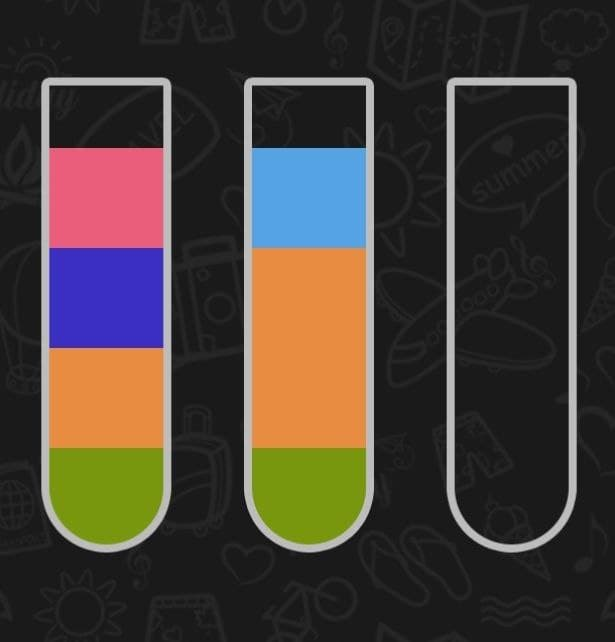

# Water Sort Puzzle Solver

This code can solve a game called "Water Sort Puzzle" 
available on APPStore and PlayMarket.

### Start Guide

Firstly, you have to install Golang. See https://go.dev/doc/install

Then with go1.16+ you're able to install a program via command:
```
go install github.com/pkositsyn/water-sort-puzzle-solver/cmd/watersortsolver@latest
```
This will install the program into `$GOPATH/bin`. 
To find out where `$GOPATH` is, run `go env GOPATH`. 
Instead of `@latest`, you can also use a specific version, such as `@1.0.0`

### Running program
After executing the program you have to provide starting position of the game. 

#### Position string representation

The position consists of letters, according to colors, and `;` separating different flasks.
One letter maps to one color, and actually you can use any letter for any color (just make sure that one color is represented by one letter)

In this game one flask consists of 4 water tiles. If we say H = blue, Z = red, D = yellow, 
then a flask of (yellow, yellow, red, blue) - colors from bottom to the top - is represented like this: `DDZH`

3 exact same flasks like above and 2 empty flasks at the end are written in this way: `DDZH;DDZH;DDZH;;`

##### Example
<p></p>

Let P = pink, F = dark blue, O = orange, G = green and B = blue

Then the position for these 3 flasks is: `GOFP;GOOB;`

#### Program output

For example above the solution doesn't exist, so we get:
```
Input initial puzzle state
GOFP;GOOB;
Cannot solve puzzle: solution doesn't exist
```

If we consider position `O;OOO` (which means one orange in first flask and 3 in another)
then we get the following:

```
Input initial puzzle state
O;OOO
Puzzle solved in 1 steps!
1 2
```

Which means that we need to move orange from 1st flask to the 2nd.
Eventually, this gives position `;OOOO` which ends the game round.

### Program flags

Via `--algorithm` command line flag you can choose the algorithm used to search for solution.
Possible choices are currently `A*, IDA*, Dijkstra` (default `A*`). Example: `watersortsolver --algorithm idastar`.
See `watersortsolver --help` for correct names for algorithms

### Notes

The solution produced by the program is minimal in number of steps needed to solve the puzzle.
Implementation uses `A*/IDA*/Dijkstra` graph algorithms to solve puzzles efficiently.

I also wrote tests for the first 50 rounds of the game, so the code is kind of stable.


